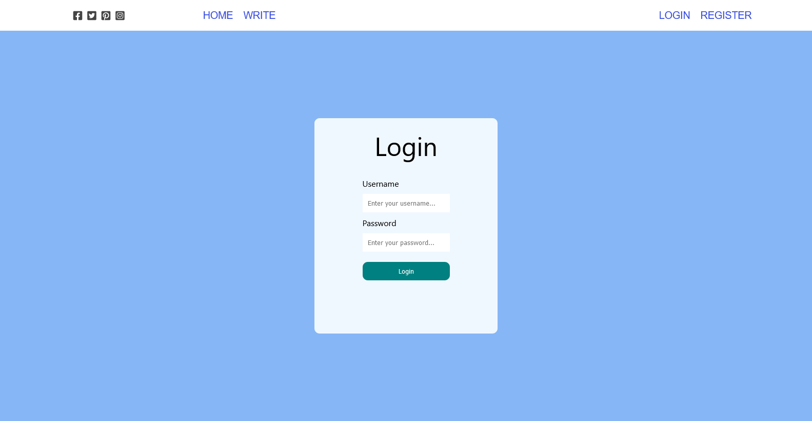
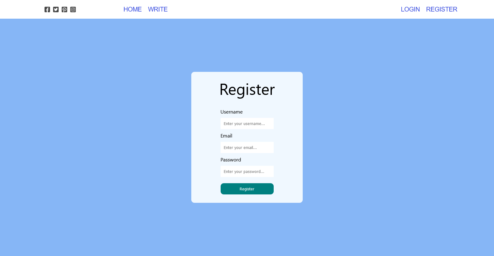

# Blog Post for alx project

## Overview

## Technologies Used

- **Node.js**: The backend of the web service is powered by Node.js, providing a robust and scalable server environment.
- **React.js**: The frontend is built using React.js, a popular JavaScript library for building user interfaces. React.js enables the creation of dynamic and interactive user interfaces.

## Screenshots

## Author
- Eyob Kefale

