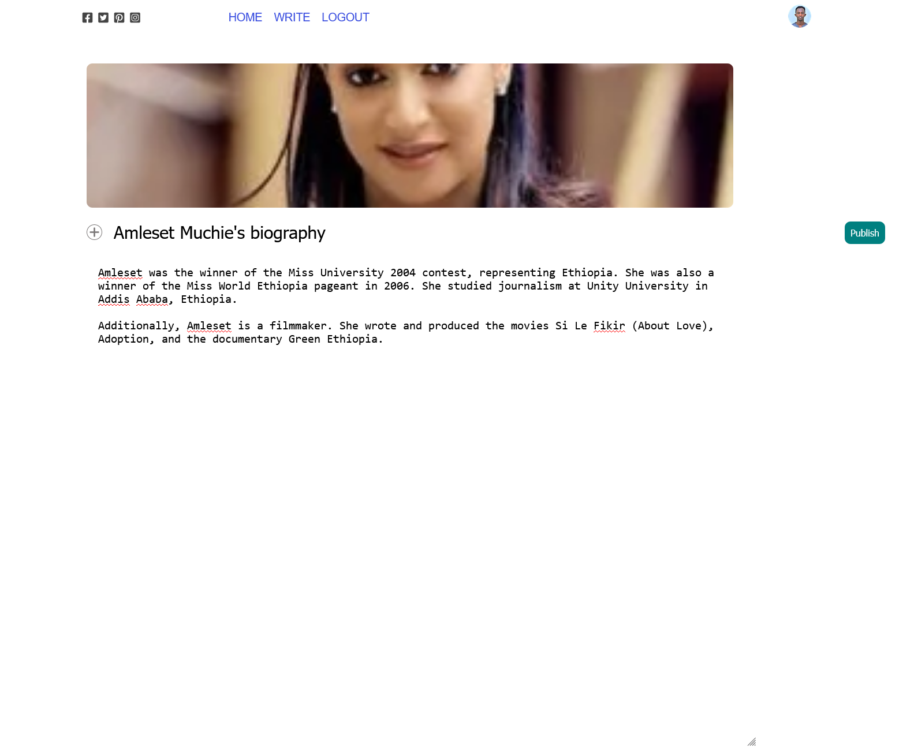
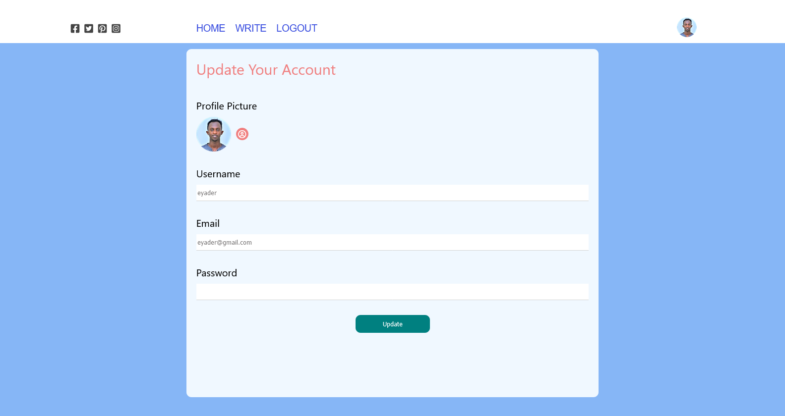

# Blog Post Web Service Project

## Overview

This project was developed as the final project for the Web Service course. The goal of the project is to showcase the integration of Node.js and React.js to create a web service.

## Technologies Used

- **Node.js**: The backend of the web service is powered by Node.js, providing a robust and scalable server environment.
- **React.js**: The frontend is built using React.js, a popular JavaScript library for building user interfaces. React.js enables the creation of dynamic and interactive user interfaces.

## Screenshots

page.png)

## Authors
- Eyob Kefale
- Eyader Tsehayu
- Biruk Birhanu
